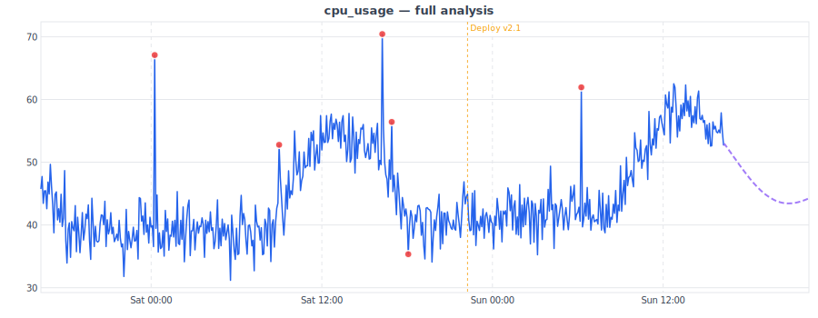

# TimelessMetrics

Embedded time series database for Elixir. Combines [Gorilla compression](https://github.com/awksedgreep/gorilla_stream) with zstd for fast, compact metric storage with automatic rollups and configurable retention.

Run it as a library inside your Elixir app or as a standalone container.

## Performance

Benchmarked with realistic ISP/network data (100 devices, 20 metrics each, 90 days of 5-minute samples):

### Write Throughput

| Write Path | Throughput |
|---|---|
| Single series write | ~4M points/sec |
| Pre-resolved write (bypass registry) | ~6M points/sec |
| Batch write | ~4M points/sec |
| Concurrent batch, pre-resolved | ~9.5M points/sec |

### Query Latency (2K series, 5.2M points, 100 iterations)

| Query | Avg | P50 | P99 |
|---|---|---|---|
| Raw points (1h) | <0.1ms | <0.1ms | <0.1ms |
| Raw points (24h) | ~0.1ms | ~0.1ms | ~0.2ms |
| Aggregation (1h, 60s buckets) | ~0.1ms | ~0.1ms | ~0.2ms |
| Aggregation (24h, 5m buckets) | ~0.2ms | ~0.2ms | ~0.3ms |
| Multi-series (100 hosts, 1h) | ~2ms | ~2ms | ~3ms |
| Latest value | <0.1ms | <0.1ms | <0.1ms |
| Tier query: hourly (7d) | <0.1ms | <0.1ms | <0.1ms |
| Tier query: daily (90d) | <0.1ms | <0.1ms | <0.1ms |

### Storage Efficiency

| Metric | Value |
|---|---|
| Compression ratio | 11.5x (~95% reduction) |
| Bytes per point | ~0.67 |
| Compression engine | Gorilla (delta-of-delta + XOR) + zstd |

Run `mix bench` to reproduce on your hardware. Use `--tier stress` for 10K devices.

## Features

- **High throughput** — 4M+ points/sec ingest, 9.5M+ points/sec concurrent pre-resolved writes
- **Compact storage** — Gorilla + zstd compression, 11.5x ratio (~95% reduction)
- **Sharded writes** — parallel buffer/builder shards across CPU cores
- **Automatic rollups** — configurable tiers (hourly, daily, monthly) with retention policies
- **VictoriaMetrics compatible** — JSON line import, works with Vector, Grafana, and existing VM tooling
- **Prometheus compatible** — text exposition import and PromQL-compatible query endpoint for Grafana
- **SVG charts** — pure Elixir chart rendering, embeddable via `` tags with light/dark/auto themes
- **Built-in dashboard** — zero-dependency HTML overview with auto-refresh
- **Annotations** — event markers (deploys, incidents) that overlay on charts
- **Forecasting** — polynomial trend + Fourier seasonal regression, auto-detects daily/weekly/yearly periods
- **Anomaly detection** — z-score analysis on model residuals with configurable sensitivity
- **Capacity planning** — forecast from daily/weekly data to predict growth months or years ahead
- **Alerts** — threshold-based rules with webhook notifications (ntfy.sh, Slack, etc.)
- **Metric metadata** — type, unit, and description registration
- **Zero external dependencies** — SQLite + pure Elixir, no Nx/Scholar/ML libraries required

## Quick Start

### As a library

Add to your `mix.exs`:

```elixir
{:timeless_metrics, "~> 0.6"}
```

Add to your supervision tree:

```elixir
children = [
  {TimelessMetrics, name: :metrics, data_dir: "/var/lib/metrics"},
  {TimelessMetrics.HTTP, store: :metrics, port: 8428}
]
```

Write and query:

```elixir
TimelessMetrics.write(:metrics, "cpu_usage", %{"host" => "web-1"}, 73.2)

{:ok, points} = TimelessMetrics.query(:metrics, "cpu_usage", %{"host" => "web-1"},
  from: System.os_time(:second) - 3600)
```

### As a container

```bash
podman build -f Containerfile -t timeless_metrics:latest .
podman run -d -p 8428:8428 -v timeless_data:/data:Z localhost/timeless_metrics:latest
```

Ingest data:

```bash
curl -X POST http://localhost:8428/api/v1/import -d '
{"metric":{"__name__":"cpu_usage","host":"web-1"},"values":[73.2],"timestamps":[1700000000]}'
```

Query:

```bash
curl 'http://localhost:8428/api/v1/query_range?metric=cpu_usage&from=-1h&step=60'
```

Embed a chart with forecast and anomaly overlays:

```html

```

Forecast future values:

```bash
curl 'http://localhost:8428/api/v1/forecast?metric=cpu_usage&from=-24h&step=300&horizon=6h'
```

Detect anomalies:

```bash
curl 'http://localhost:8428/api/v1/anomalies?metric=cpu_usage&from=-24h&step=300&sensitivity=medium'
```

View the dashboard at `http://localhost:8428/`.

## Elixir API

### Writing

```elixir
# Single write
TimelessMetrics.write(:metrics, "cpu_usage", %{"host" => "web-1"}, 73.2)

# Pre-resolved writes (bypass series lookup — faster for hot paths)
series_id = TimelessMetrics.resolve_series(:metrics, "cpu_usage", %{"host" => "web-1"})
TimelessMetrics.write_resolved(:metrics, series_id, 73.2)

# Batch writes
TimelessMetrics.write_batch(:metrics, [
  {"cpu_usage", %{"host" => "web-1"}, 73.2},
  {"mem_usage", %{"host" => "web-1"}, 4096.0}
])
```

### Querying

```elixir
# Raw points for a specific series
{:ok, points} = TimelessMetrics.query(:metrics, "cpu_usage", %{"host" => "web-1"},
  from: System.os_time(:second) - 3600)

# Aggregated query (bucketed)
{:ok, points} = TimelessMetrics.query_aggregate(:metrics, "cpu_usage", %{"host" => "web-1"},
  from: System.os_time(:second) - 3600, bucket: {60, :seconds}, aggregate: :avg)

# Multi-series query (all series matching a label filter)
{:ok, results} = TimelessMetrics.query_multi(:metrics, "cpu_usage", %{"host" => "web-1"},
  from: System.os_time(:second) - 3600)

# Query from rollup tiers
{:ok, points} = TimelessMetrics.query_tier(:metrics, :daily, "cpu_usage", %{"host" => "web-1"},
  from: System.os_time(:second) - 86_400 * 30)
```

### Stats

```elixir
info = TimelessMetrics.info(:metrics)

# %{
#   series_count: 150,
#   segment_count: 42,
#   total_points: 1_250_000,
#   raw_compressed_bytes: 837_500,
#   bytes_per_point: 0.67,
#   storage_bytes: 24_000_000,
#   buffer_points: 320,
#   buffer_shards: 4,
#   oldest_timestamp: 1700000000,
#   newest_timestamp: 1700086400,
#   tiers: [%{name: :hourly, chunks: 24, buckets: 3600, ...}, ...],
#   ...
# }
```

### Discovery

```elixir
TimelessMetrics.list_metrics(:metrics)
#=> ["cpu_usage", "mem_usage", "disk_io"]

TimelessMetrics.list_series(:metrics, "cpu_usage")
#=> [%{series_id: 1, labels: %{"host" => "web-1"}}, ...]

TimelessMetrics.label_values(:metrics, "cpu_usage", "host")
#=> ["web-1", "web-2", "db-1"]
```

### Operations

```elixir
TimelessMetrics.flush(:metrics)              # Force flush all buffer shards
TimelessMetrics.rollup(:metrics)             # Run rollup aggregation
TimelessMetrics.compact(:metrics)            # Compact raw segments
TimelessMetrics.enforce_retention(:metrics)  # Clean up expired data
TimelessMetrics.backup(:metrics, "/tmp/bak") # Online backup
```

## HTTP Endpoints

| Method | Path | Description |
|--------|------|-------------|
| `POST` | `/api/v1/import` | VictoriaMetrics JSON line ingest |
| `POST` | `/api/v1/import/prometheus` | Prometheus text format ingest |
| `GET` | `/api/v1/export` | Export raw points (VM JSON line format) |
| `GET` | `/api/v1/query` | Latest value for matching series |
| `GET` | `/api/v1/query_range` | Range query with bucketed aggregation |
| `GET` | `/prometheus/api/v1/query_range` | Grafana-compatible Prometheus endpoint |
| `GET` | `/api/v1/label/__name__/values` | List all metric names |
| `GET` | `/api/v1/label/:name/values` | List values for a label key |
| `GET` | `/api/v1/series` | List series for a metric |
| `POST` | `/api/v1/metadata` | Register metric metadata |
| `GET` | `/api/v1/metadata` | Get metric metadata |
| `POST` | `/api/v1/annotations` | Create an annotation |
| `GET` | `/api/v1/annotations` | Query annotations |
| `DELETE` | `/api/v1/annotations/:id` | Delete an annotation |
| `POST` | `/api/v1/alerts` | Create an alert rule |
| `GET` | `/api/v1/alerts` | List alert rules |
| `DELETE` | `/api/v1/alerts/:id` | Delete an alert rule |
| `GET` | `/api/v1/forecast` | Forecast future values |
| `GET` | `/api/v1/anomalies` | Detect anomalies |
| `GET` | `/chart` | SVG chart (supports `&forecast=` and `&anomalies=` overlays) |
| `GET` | `/health` | Health check with stats |
| `GET` | `/` | HTML dashboard |

See [docs/API.md](docs/API.md) for full request/response documentation with examples.

## Forecasting & Anomaly Detection

TimelessMetrics includes a built-in forecast engine and anomaly detector — no external ML libraries needed. The pure Elixir normal equation solver runs in ~3ms for a year of daily data.

Seasonal periods are auto-detected from the data's sampling interval:

| Sampling | Periods | Use Case |
|---|---|---|
| Sub-hourly | Daily + half-daily | Operational monitoring |
| Hourly | Daily + weekly | Trend analysis |
| Daily+ | Weekly + yearly | Capacity planning |

### Elixir API

```elixir
# Forecast 6 hours ahead from 24h of 5-minute data
{:ok, results} = TimelessMetrics.forecast(:metrics, "cpu_usage", %{"host" => "web-1"},
  from: now - 86_400, horizon: 21_600, bucket: {300, :seconds})

# Detect anomalies
{:ok, results} = TimelessMetrics.detect_anomalies(:metrics, "cpu_usage", %{"host" => "web-1"},
  from: now - 86_400, bucket: {300, :seconds}, sensitivity: :medium)

# Capacity planning: 1 year of daily data → 1 year forecast
{:ok, results} = TimelessMetrics.forecast(:metrics, "bandwidth_peak", %{},
  from: now - 365 * 86_400, horizon: 365 * 86_400, bucket: {1, :days}, aggregate: :max)
```

### Chart overlays

```html
<!-- Purple dashed forecast line + red anomaly dots -->

```



See [docs/capacity_planning.md](docs/capacity_planning.md) for detailed capacity planning guide with ISP examples.

See [docs/alerting.md](docs/alerting.md) for alert rules, webhook payloads, and integration with ntfy.sh/Slack.

## Container Configuration

| Variable | Default | Description |
|----------|---------|-------------|
| `TIMELESS_DATA_DIR` | `/data` | Storage directory |
| `TIMELESS_PORT` | `8428` | HTTP listen port |
| `TIMELESS_SHARDS` | `schedulers / 2` | Write buffer shard count |
| `TIMELESS_SEGMENT_DURATION` | `14400` | Raw segment duration (seconds) |
| `TIMELESS_BEARER_TOKEN` | *(none)* | Bearer token for API auth (unset = no auth) |

## Authentication

Set `TIMELESS_BEARER_TOKEN` to require authentication on all endpoints (except `/health`):

```bash
# Via env var
TIMELESS_BEARER_TOKEN=my-secret-token podman run -d -p 8428:8428 ...

# API access
curl -H "Authorization: Bearer my-secret-token" http://localhost:8428/api/v1/query_range?...

# Browser access (dashboard, charts) via query param
http://localhost:8428/chart?metric=cpu_usage&from=-6h&token=my-secret-token
```

When unset, all endpoints are open (backwards compatible, for trusted networks).

## Podman Quadlet

Copy `timeless.container` to `~/.config/containers/systemd/`:

```bash
cp timeless.container ~/.config/containers/systemd/
systemctl --user daemon-reload
systemctl --user start timeless
```

## Architecture

```
Writes ──> Buffer Shards (ETS) ──> Segment Builders ──> Shard Stores (.seg files)
                                                              │
                                              Rollup Engine ──┤── hourly tier
                                                              ├── daily tier
                                                              └── monthly tier

Main DB (SQLite): series registry, metadata, annotations, alerts
Shard Stores: immutable .seg files + WAL for raw data, tier chunk files
```

- **Buffer shards** — lock-free ETS tables, `schedulers/2` shards (min 2), flushed every 5s or 10K points
- **Segment builders** — Gorilla + zstd compression, one per shard for parallel writes
- **Shard stores** — immutable `.seg` segment files per shard, no SQLite for raw data
- **Rollup engine** — parallel per-shard aggregation into configurable tiers
- **Retention enforcer** — periodic cleanup of expired raw data and tier rows
- **SQLite** — WAL mode, mmap, used only for series registry + metadata (not raw data)

## Custom Rollup Schema

```elixir
defmodule MyApp.MetricsSchema do
  use TimelessMetrics.Schema

  raw_retention {7, :days}

  tier :hourly,
    resolution: :hour,
    aggregates: [:avg, :min, :max, :count, :sum, :last],
    retention: {30, :days}

  tier :daily,
    resolution: :day,
    aggregates: [:avg, :min, :max, :count, :sum, :last],
    retention: {365, :days}

  tier :monthly,
    resolution: {30, :days},
    aggregates: [:avg, :min, :max, :count, :sum, :last],
    retention: :forever
end
```

```elixir
{TimelessMetrics, name: :metrics, data_dir: "/data", schema: MyApp.MetricsSchema}
```

## License

MIT
