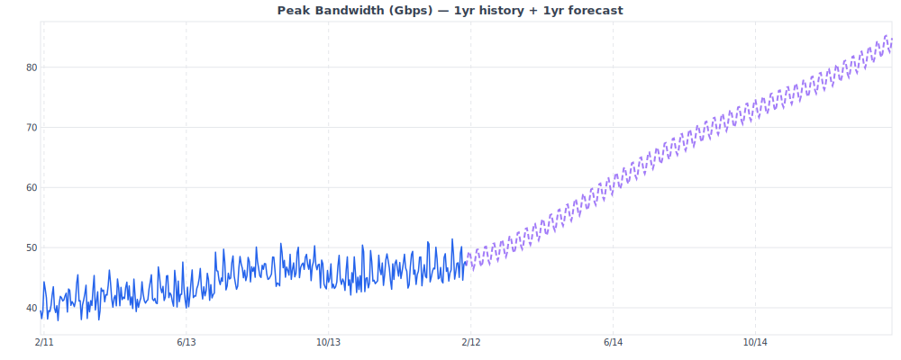

# Capacity Planning with TimelessMetrics

TimelessMetrics includes built-in forecasting and anomaly detection that works at any time scale — from 5-minute operational monitoring to multi-year capacity planning. No external ML libraries required.

## How It Works

The forecast engine fits a **polynomial trend + Fourier seasonal model** to your historical data:

```
y(t) = a₀ + a₁t + a₂t² + Σ [bₖ sin(2πt/Pₖ) + cₖ cos(2πt/Pₖ)]
```

Seasonal periods are **auto-detected** based on your data's sampling interval:

| Sampling Interval | Detected Periods | Use Case |
|---|---|---|
| < 1 hour (e.g. 5min) | Daily (24h) + Half-daily (12h) | Operational monitoring |
| 1–23 hours | Daily (24h) + Weekly (7d) | Hourly trends |
| >= 1 day | Weekly (7d) + Yearly (365d) | Capacity planning |

You can also set periods explicitly with the `:periods` option for full control.

## Quick Start: Bandwidth Growth Forecast

Given 1 year of daily peak bandwidth data, forecast the next year:

```elixir
# Query 1 year of daily peak bandwidth
{:ok, results} =
  TimelessMetrics.query_aggregate(:my_store, "bandwidth_peak", %{"region" => "east"},
    from: now - 365 * 86_400,
    to: now,
    bucket: {:day, :days},
    aggregate: :max
  )

# Forecast 1 year ahead
{:ok, forecast} =
  TimelessMetrics.Forecast.predict(results,
    horizon: 365 * 86_400,
    bucket: 86_400
  )

# forecast = [{future_ts, predicted_value}, ...]
```

The model automatically picks weekly + yearly seasonal periods for daily data.

## Capacity Threshold Analysis

Use the forecast to find when you'll hit capacity limits:

```elixir
max_capacity = 100.0  # Gbps

{:ok, forecast} =
  TimelessMetrics.Forecast.predict(historical_data,
    horizon: 365 * 86_400,
    bucket: 86_400
  )

# Find first day that exceeds 80% utilization
breach_point =
  Enum.find(forecast, fn {_ts, val} ->
    val / max_capacity >= 0.80
  end)

case breach_point do
  {ts, val} ->
    days_until = div(ts - now, 86_400)
    IO.puts("80% capacity in #{days_until} days (~#{Float.round(val, 1)} Gbps)")

  nil ->
    IO.puts("No capacity concern within forecast horizon")
end
```

## Via HTTP API

### Forecast endpoint

```bash
# 1 year of daily data, forecast 6 months ahead
curl "http://localhost:8428/api/v1/forecast?\
metric=bandwidth_peak&region=east&\
from=$(date -d '1 year ago' +%s)&to=$(date +%s)&\
step=86400&horizon=15768000"
```

Response:

```json
{
  "metric": "bandwidth_peak",
  "series": [{
    "labels": {"region": "east"},
    "data": [[1707350400, 42.3], ...],
    "forecast": [[1738886400, 48.1], ...]
  }]
}
```

### SVG chart with forecast overlay

```html
<!-- Embed in dashboards, reports, or emails -->

```

The purple dashed line shows the forecast extending beyond the historical data.

### Anomaly detection on historical trends

```bash
# Flag days with unusual growth/dips
curl "http://localhost:8428/api/v1/anomalies?\
metric=bandwidth_peak&region=east&\
from=$(date -d '1 year ago' +%s)&to=$(date +%s)&\
step=86400&sensitivity=medium"
```

## Custom Seasonal Periods

Override auto-detection when you know your data's patterns:

```elixir
# Monthly + quarterly seasonality for billing data
TimelessMetrics.Forecast.predict(data,
  horizon: 365 * 86_400,
  bucket: 86_400,
  periods: [30 * 86_400, 90 * 86_400]
)

# No seasonality — pure trend (polynomial only)
TimelessMetrics.Forecast.predict(data,
  horizon: 365 * 86_400,
  bucket: 86_400,
  periods: []
)
```

The same `:periods` option works with anomaly detection:

```elixir
TimelessMetrics.Anomaly.detect(data,
  sensitivity: :medium,
  periods: [7 * 86_400]  # weekly only
)
```

## ISP Capacity Planning Examples

### Port utilization forecast

```elixir
# Daily peak utilization per uplink port, forecast 1 year
{:ok, forecasts} =
  TimelessMetrics.forecast(:metrics, "port_utilization", %{"port" => "ae0"},
    from: now - 365 * 86_400,
    to: now,
    horizon: 365 * 86_400,
    bucket: {1, :days},
    aggregate: :max
  )
```

### Subscriber growth

```elixir
# Weekly active subscriber count, forecast 2 years
{:ok, forecasts} =
  TimelessMetrics.forecast(:metrics, "active_subscribers", %{},
    from: now - 730 * 86_400,
    to: now,
    horizon: 730 * 86_400,
    bucket: {7, :days},
    aggregate: :last
  )
```

### DHCP pool exhaustion

```elixir
# Daily peak lease count per pool
{:ok, forecasts} =
  TimelessMetrics.forecast(:metrics, "dhcp_leases", %{"pool" => "residential"},
    from: now - 180 * 86_400,
    to: now,
    horizon: 365 * 86_400,
    bucket: {1, :days},
    aggregate: :max
  )

# Check when pool (4094 addresses) hits 90%
pool_size = 4094
Enum.find(forecasts, fn
  %{forecast: predictions} ->
    Enum.any?(predictions, fn {_ts, val} -> val / pool_size >= 0.90 end)
end)
```

## Interpreting Results

**The quadratic trend** (`a₁t + a₂t²`) captures accelerating growth patterns. This means:

- For steady linear growth, the forecast will be accurate
- For accelerating growth (new subscribers, expanding coverage), it tracks well
- For growth that's plateauing, it may overpredict — which is the safer direction for capacity planning

**Seasonal components** capture repeating patterns. For daily-sampled ISP data:

- **Weekly**: weekend streaming peaks vs weekday business traffic
- **Yearly**: summer streaming surges, holiday shopping, back-to-school

**Anomaly detection** on capacity data flags:

- Unexpected traffic spikes (DDoS, viral events, misconfiguration)
- Sudden drops (outages, routing changes, customer churn)
- Seasonal anomalies (holiday traffic exceeding the model's expectations)

## Performance

The forecast engine uses a native normal equation solver — no Nx, no Scholar, no external dependencies:

| Data Size | Forecast Time | Memory |
|---|---|---|
| 365 points (1yr daily) | ~3ms | Negligible |
| 730 points (2yr daily) | ~5ms | Negligible |
| 8,760 points (1yr hourly) | ~50ms | Negligible |
| 105,120 points (1yr 5min) | ~800ms | ~50MB |

## Running the Example

Generate example capacity planning charts:

```bash
mix run examples/capacity_planning.exs
```

This creates `docs/examples/chart_capacity_planning.svg` and `chart_capacity_dark.svg` showing 1 year of simulated bandwidth data with a 1-year forecast overlay.


